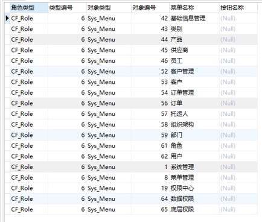
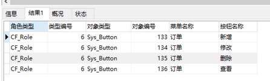

## 查询用户test1可以查看的页面
sql语句如下   
SELECT cp.PrivilegeMaster AS '角色类型',    
    cp.PrivilegeMasterKey AS '类型编号',    
    cp.PrivilegeAccess AS '对象类型',    
    cp.PrivilegeAccessKey AS '对象编号',    
    sm.MenuName AS '菜单名称'    
 FROM cf_privilege AS cp    
  LEFT JOIN sys_menu AS sm ON cp.PrivilegeAccessKey = sm.MenuID AND cp.PrivilegeAccess = 'Sys_Menu'  
 WHERE ((cp.PrivilegeMaster = 'CF_Role'  
     AND cp.PrivilegeMasterKey    
     IN (SELECT RoleID FROM cf_userrole AS cur
       LEFT JOIN cf_user AS cu ON cur.UserID = cu.UserID WHERE cu.LoginName='test1' ))  
    OR  
     (cp.PrivilegeMaster = 'CF_User'  
     AND cp.PrivilegeMasterKey = (SELECT UserID FROM cf_user WHERE LoginName = 'test1')))  
    AND  
     cp.PrivilegeOperation = 'Permit' AND cp.PrivilegeAccess = 'Sys_Menu';  
     伪代码：  
     1、根据名称查找人员编号UserID  
     2、根据人员的编号UserID查找该人员所对应的角色集合RoleIDs  
     3、在权限表LEFT JOIN 页面表中查找角色类型为CF_Role   AND   角色编号在角色集合RoleIDs中  
  OR  角色类型为CF_User   AND   人员编号为UserID  AND 权限属性为Permit   AND   权限为Sys_Menu的数据  
   查询结果如图：
    
  **查看订单页面中的操作权限** 
  sql语句如下：  
  SELECT cp.PrivilegeMaster AS '角色类型', 
    cp.PrivilegeMasterKey AS '类型编号', 
    cp.PrivilegeAccess AS '对象类型', 
    cp.PrivilegeAccessKey AS '对象编号', 
    sb.BtnName AS '按钮名称' 
 FROM cf_privilege AS cp 
  LEFT JOIN sys_button AS sb ON cp.PrivilegeAccessKey = sb.BtnID AND cp.PrivilegeAccess = 'Sys_Button' 
  LEFT JOIN sys_menu AS sm ON sb.MenuNo = sm.MenuNo 
 WHERE ((cp.PrivilegeMaster = 'CF_Role' 
     AND cp.PrivilegeMasterKey 
     IN (SELECT RoleID FROM cf_userrole AS cur 
       LEFT JOIN cf_user AS cu ON cur.UserID = cu.UserID WHERE cu.LoginName='test1' )) 
    OR 
     (cp.PrivilegeMaster = 'CF_User' 
     AND cp.PrivilegeMasterKey = (SELECT UserID FROM cf_user WHERE LoginName = 'test1'))) 
    AND 
     cp.PrivilegeOperation = 'Permit' AND cp.PrivilegeAccess = 'Sys_Button' AND sm.MenuName = '订单'; 
     伪代码： 
   1、根据名称查找人员编号UserID 
   2、根据人员编号UserID查找改人员所对应的角色集合RoleIDs 
   3、权限表 LEFT JOIN 按钮表 LEFT JOIN 页面表并查找
   角色类型为CF_Role   AND   角色编号在角色集合RoleIDs中
  OR
   角色类型为CF_User   AND   人员编号为UserID
  AND 权限属性为Permit   AND   权限为Sys_Button AND 菜单名字为订单的数据 
 查询结果如图 
  
  
